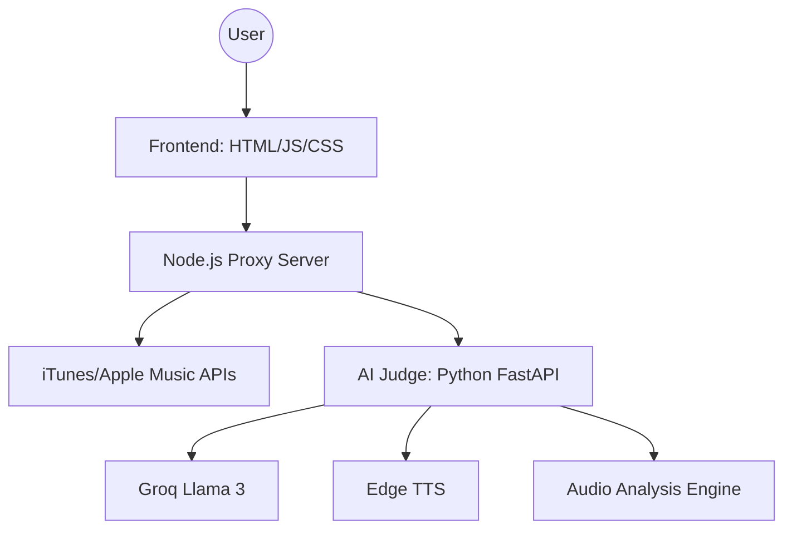

<div align="center">

# 🎵 Musify

**Experience music in its purest aesthetic form.**

[](https://adixdd-musify.netlify.app/)
[](https://github.com/adityaprajapati-0/Musify)
[](LICENSE)

<br/>

> [!TIP]
> **Musify** is a multi-page, ultra-aesthetic music web application featuring high-end glassmorphism, real-time data sync, and an AI-powered Singing Judge.

</div>

---

## 💎 Features at a Glance

| Feature              | Description                                                                |
| :------------------- | :------------------------------------------------------------------------- |
| **🎨 Premium UI**    | Fluid glassmorphism, animated wave effects, and curated color palettes.    |
| **⚡ Shared Player** | Persistent top bar player that stays synced as you navigate between pages. |
| **🤖 AI Judge**      | Voice-cloning and LLM-powered feedback for your singing performances.      |
| **🔍 Smart Search**  | Deep integration with iTunes and Apple Music for real-time song data.      |
| **📱 Responsive**    | Edge-to-edge aesthetic flow adapted for both desktop and mobile users.     |

---

## 🏗️ System Architecture



---

## 🚀 Getting Started

### 1. Launch the Backend & Proxy

```powershell
.\start-server.ps1 -Port 5501
```

### 2. Prepare the AI Engine

```powershell
cd "ai_engine"
pip install -r requirements.txt
uvicorn main:app --host 0.0.0.0 --port 8000
```

### 3. Open the Experience

Navigate to [adixdd-musify.netlify.app](https://adixdd-musify.netlify.app/) and start the flow.

---

## 🛠️ Tech Stack Showcase

<div align="center">


</div>

---

## 📂 Project Structure

- `index.html` — The minimalist hero entry point.
- `songs.html` — Trending charts and artist discovery.
- `ai.html` — The high-tech Singing Judge interface.
- `common.js` — Core logic and state management.
- `server.js` — The robust local proxy layer.
- `ai_engine/` — Deep learning audio processing & feedback.

---

<div align="center">

_Crafted with passion for the ultimate music discovery experience._

**© 2026 Musify Team**

</div>
